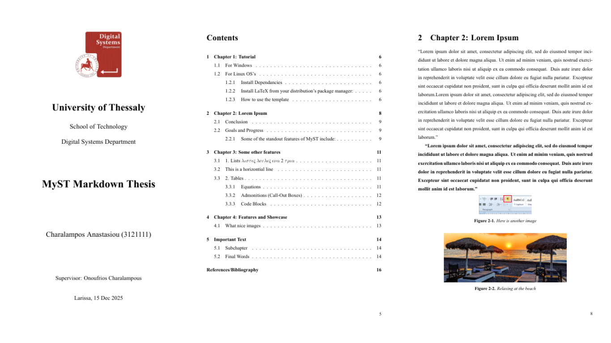

# DS MyST Markdown Thesis Template

## Overview
A simple to use [MyST](https://mystmd.org/) template made for writing scientific papers tailored for UTH's Digital Systems students.

This project aims to replace the existing Microsoft Word template, allowing students to use MyST's and LaTeX's powerful tooling to easily create quality, lightweight documents.

### Features:
- MyST directives for equations, citations, figures, cross-references
- Automated references/bibliography with bibtex
- Output to multiple formats: PDF/HTML/DOCX
- Single file configuration
- Digital Signature Support
- Version control with git

### Showcase:



## Prerequisites:
- Python 3.8+
- Git
- [MyST](https://mystmd.org/guide/installing) 
- LaTeX utilities (latexmk, xelatex, texlive-core, texlive-latexextra)
- A code editor is optional but recommended.

Specialized instructions for Windows, [Linux](instructions/linux_install.md), Mac


## Quickstart

Open a terminal window and run the following commands:

```
git clone https://github.com/Lamampis/ds_myst_template.git
cd ds_uth_thesis
```


You can edit the options inside myst.yml to configure the project to your liking. Once you are ready, 
you can create the document by running:

`myst build --pdf`
(Say yes if you are prompted to install NodeJS)

**You are good to go!** The created file is called thesis.pdf by default. You can start editing files in the /content folder and add your own images in the /images folder.
You can recomplile after any change by running `myst build --pdf`.

## Important Tips:
- Bibliography/References is handled by references.bib inside the /content folder by default.
- All markdown files must be specified in the `toc` section of myst.yml in order.
- Editing the ds_uth_thesis template folder is not recommended nor needed. Only edit if you know what you are doing!
- You must have a valid LaTeX installation to compile the document.
- The _build folder is created temporarily for each build and can be deleted afterwards.
- Greek Characters are not yet supported.

## Contributing
This project is very much still ongoing and not ready to be used. However, anybody is welcome to contribute in any way they can. More specifically, I'm looking for ways to make Greek characters work, and a more elegant way to handle the abstract, preferably in a standalone md file and not inside myst.yml.
