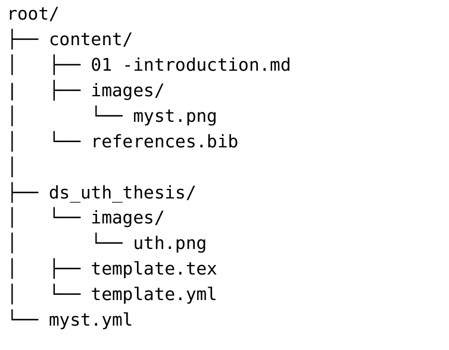

# Παρουσίαση της Γλώσσας Σήμανσης Markdown και Ανάπτυξη Πρότυπου MyST για Πτυχιακές Εργασίες

--- 

## Σκοπός Εργασίας
* **Εναλλακτική στο MS Word**: Αντικατάσταση του κλασικού Word template του Τμήματος.
* Χρήση **MyST Markdown**.

---

## Τι είναι η Markdown;
* **Ελαφριά γλώσσα σήμανσης** (lightweight markup language).
* **Απλή σύνταξη**: Συγγραφή σε απλό κείμενο (plain text).
* **Εστίαση στο περιεχόμενο**: Γρήγορη συγγραφή χωρίς περισπασμούς μορφοποίησης.
* **Φορητότητα**: Cross-platform και συμβατή με συστήματα ελέγχου εκδόσεων (Git/GitHub).

---

## Τι είναι η LaTeX;
* **Σύστημα στοιχειοθεσίας**: Κορυφαίο εργαλείο για ακαδημαϊκά & επιστημονικά κείμενα.
* **Μαθηματικοί τύποι**: Άριστη διαχείριση εξισώσεων και συμβόλων.
* **Αυτοματισμοί**: Αυτόματη βιβλιογραφία (BibTeX) και διασταυρούμενες αναφορές.
* **Μειονέκτημα**: Περίπλοκη σύνταξη και αυστηρή καμπύλη μάθησης.

---

## Τι είναι η MyST;
* **Markedly Structured Text**: Επέκταση της Markdown με τις δυνατότητες της LaTeX.
* **Τα καλύτερα της Markdown**: Καθαρή, φιλική και γρήγορη σύνταξη.
* **Τα καλύτερα της LaTeX**: Μαθηματικά, directives, βιβλιογραφία & αναφορές.

--- 

# Σύγκριση Word και MyST

| Χαρακτηριστικό | Microsoft Word | MyST Markdown |
|---|---|---|
| Συγγραφή κειμένου | **Πολύ εύκολη** | Εύκολη |
| Μορφοποίηση | Χειροκίνητη | **Μέσω προτύπου** |
| Μαθηματικές εξισώσεις | Καλή | **Εξαιρετική** |
| Έλεγχος εκδόσεων | Περιορισμένος | **Git / GitHub** |
| Αναπαραγωγιμότητα | Μέτρια | **Υψηλή** |
| Αυτοματοποίηση | Περιορισμένη | **Εκτεταμένη** |
| Κόστος | Εμπορικό λογισμικό | **Open-Source** |
| Καμπύλη μάθησης | **Μικρή** | Μεγαλύτερη |

---

## Γρήγορο Setup
* **Προαπαιτούμενα**: Node.js, Git, Web Browser (ή XeLaTeX).
* **1. Εγκατάσταση του MyST CLI**:
  ```bash
  npm install -g mystmd
  ```
* **2. Λήψη του Template**:
  ```bash
  git clone https://github.com/Lamampis/ds_myst_template.git
  cd ds_myst_template
  ```

---

## Χρήση του Template (1/3): Δομή & Ρυθμίσεις



---

## Χρήση του Template (2/3): Δομή & Ρυθμίσεις

* **Αρχείο myst.yml**:
  * Κεντρική παραμετροποίηση (τίτλος, συγγραφέας, επιτροπή).
  * Ορισμός διάταξης & Πίνακα Περιεχομένων (Table of Contents).
* **Διάρθρωση Φακέλων**:
  * `/content`: Αρχεία `.md` για κάθε κεφάλαιο της εργασίας και εικόνες.
  * `references.bib`: Αρχείο βιβλιογραφικών αναφορών (BibTeX).

---

## Χρήση του Template (3/3): Συγγραφή & Build
* **Συγγραφή**:
  * Χρήση της Markdown για εύκολη συγγραφή.
* **Παραγωγή Τελικού PDF**:
  ```bash
  myst build --pdf
  ```

---

## Μειονεκτήματα & Περιορισμοί
* **Καμπύλη Μάθησης**: Απαιτεί βασική εξοικείωση με CLI και Markdown.
* **Αρχική Εγκατάσταση**: Χρειάζεται ρύθμιση περιβάλλοντος (Node.js / XeLaTeX).
* **Ελληνικά**: Ακόμα η χρήση της ελληνικής γλώσσας είναι περιορισμένη.

---

## Συμπεράσματα
* **Εκσυγχρονισμός**: Σύγχρονη και επαγγελματική πρόταση συγγραφής.
* **Αξιόπιστο Αποτέλεσμα**: Εγγυάται αισθητικά άρτιο και ακαδημαϊκά έγκυρο PDF.
* **Βάση για το Μέλλον**: Επεκτάσιμο πρότυπο για υιοθέτηση από το Τμήμα.

---

# Ευχαριστώ για την προσοχή σας!


### Χαράλαμπος Αναστασίου

**Τμήμα Ψηφιακών Συστημάτων**  
Πανεπιστήμιο Θεσσαλίας  
*chanastasiou@uth.gr*
